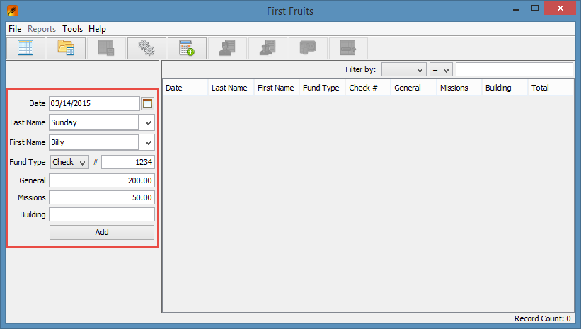
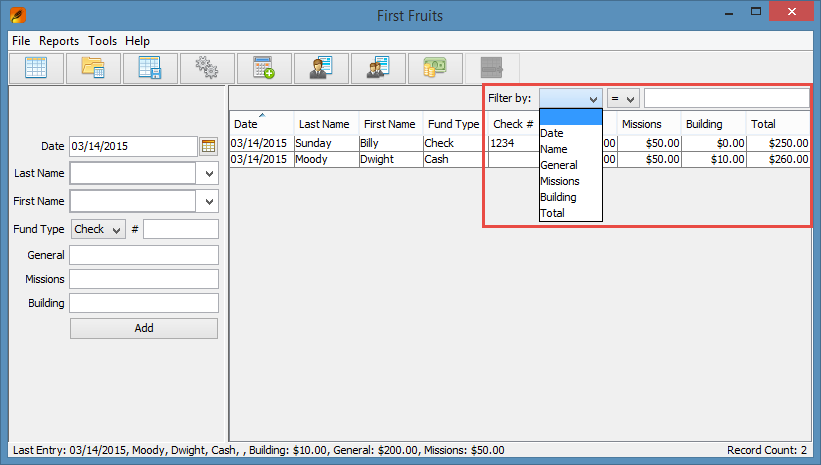
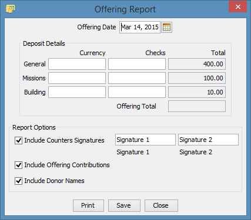
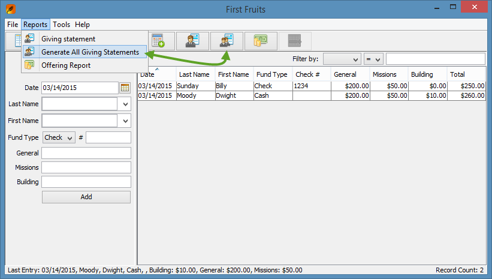

First-Fruits
=============

First Fruits is a program designed to manage giving records for Church offerings and donations. 

You can download the latest installer (exe) [here](https://www.dropbox.com/s/jf1a9t1ede6uxdz/FirstFruits_1.0-setup.exe?dl=0)

Features
=============

1. **Offering Entry**

   First Fruits has been designed to allow offering contribution entry to be fast and simple.

   

2. **Filter Records**

   You can easily filter the records that are displayed using the filter option at the top of 
   the records table.

   
 

3. **Offering Reports**

   The offering report tool allows you to balance funds for each category before running the 
   report. The report can then be printed or saved to an excel spreadsheet. Optional items include:

   - Signature fields for those counting the offering.
   - Option to include the offering contribution entries in the report.
   - If contributions are included in the report you can also choose whether or not to include the 
     donors names.

   

4. **Giving Statements**

   Generating a giving statement is as simple as selecting a donors name. You can also generate 
   reports for all donors by clicking the generate all button. 
 

The Software
=============

The software in this repository is written in Java. The software has an Eclipse project included.

Status
=============

Recently made public to promote use and contribution.

Contributing
=============

If you have interest in this project, any feedback is very welcome. Issues and pull requests also welcome.
